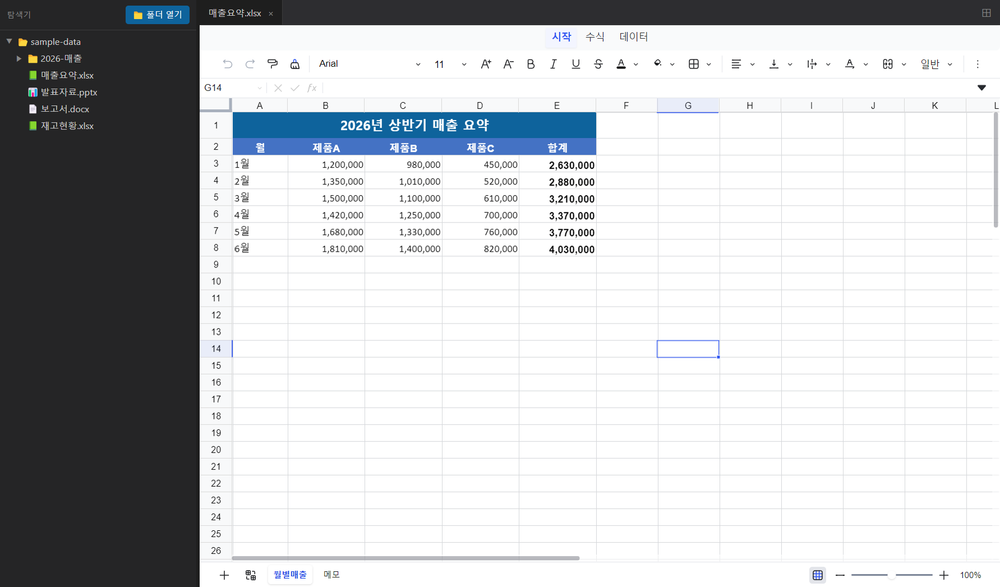
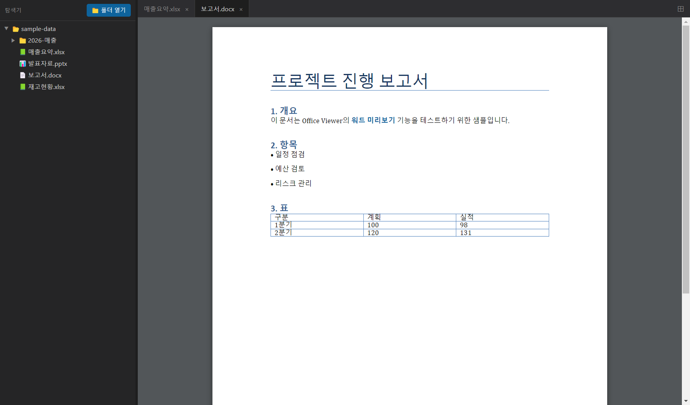
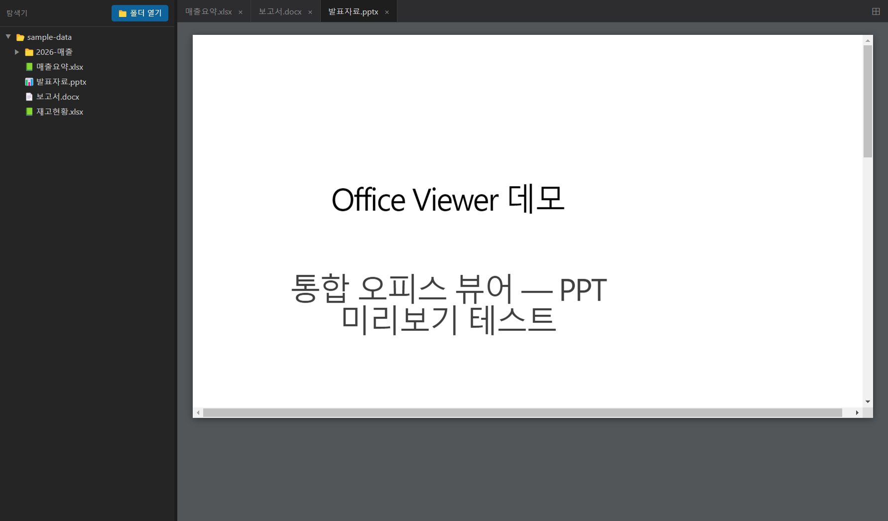
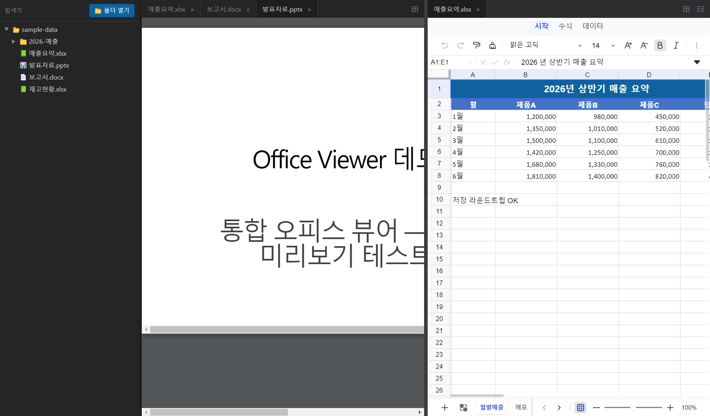

# Office Viewer 사용 방법

엑셀·워드·PPT를 **한 창에서** 탭으로 열고, 화면을 나눠 비교하는 통합 뷰어입니다.
모든 작업은 **내 컴퓨터에서 오프라인**으로 이뤄지며, 파일이 외부로 전송되지 않습니다.

---

## 1. 설치 / 실행

- **설치형:** `Office Viewer Setup 0.1.0.exe` 를 더블클릭 → 안내에 따라 설치 → 바탕화면 아이콘으로 실행
- **포터블:** zip을 풀고 `Office Viewer.exe` 더블클릭 (설치 불필요)

> 서명되지 않은 앱이라 처음 실행할 때 파란 SmartScreen 창이 뜰 수 있습니다.
> **추가 정보 → 실행** 을 누르면 됩니다. (안전한 로컬 앱입니다.)

---

## 2. 파일 여는 방법 (두 가지)

**방법 A — 폴더 열기:** 왼쪽 위 **📁 폴더 열기** 버튼으로 폴더를 선택하면, 그 안의 오피스 문서만 왼쪽 트리에 표시됩니다. 파일을 클릭하면 열립니다. 폴더(▶)를 눌러 하위 폴더도 펼칠 수 있습니다.

**방법 B — 드래그&드롭:** Windows 파일 탐색기에서 파일을 **끌어다가 뷰어 위에 놓기만** 하면 바로 열립니다. 화면을 분할해 둔 상태라면 **놓은 쪽 패널**에서 열립니다. 여러 개를 한 번에 끌어다 놓아도 됩니다.

---

## 3. 엑셀 열기 · 편집 · 저장

탐색기에서 엑셀 파일을 클릭하면 오른쪽에 **탭으로** 열립니다.
셀 색·병합·천단위·수식·여러 시트가 원본 그대로 표시되고, **셀을 클릭해 바로 편집**할 수 있습니다.

- 편집하면 탭 이름 앞에 **●** 표시가 생깁니다(저장 안 됨 표시).
- **Ctrl + S** 를 누르면 원본 .xlsx 파일에 **서식을 유지한 채 저장**됩니다. (저장되면 ● 가 사라집니다.)
- 하단의 시트 탭(예: 월별매출 / 메모)으로 시트를 전환합니다.

---

## 4. 워드(.docx) 미리보기

워드 문서를 클릭하면 페이지 형태로 미리보기가 열립니다. 제목·서식·표·목록이 그대로 보입니다.
(워드는 **보기 전용**입니다. 편집이 필요하면 구버전 안내처럼 원래 프로그램을 사용하세요.)

---

## 5. PPT(.pptx) 미리보기

발표자료를 클릭하면 슬라이드가 차례로 표시됩니다. (PPT도 **보기 전용**입니다.)

---

## 6. 화면 나눠 보기 (분할)

두 파일을 나란히 비교하고 싶을 때 사용합니다.

**가장 쉬운 방법 — 탭을 끌어다 놓기:**
- 탭을 **화면 오른쪽 가장자리로 드래그**하면 그 자리에서 **좌우로 분할**됩니다.
- 분할된 탭을 **다른 패널의 탭 줄로 드래그**하면 다시 **한 화면으로 합쳐집니다**.

버튼으로도 가능합니다:
1. 탭바 **오른쪽 끝의 ⊞ 버튼**을 누르면 화면이 좌우로 나뉩니다.
2. 새로 생긴 패널이 활성화된 상태에서 탐색기의 다른 파일을 클릭하면 그쪽에 열립니다.
3. 두 패널 **사이 경계선을 마우스로 드래그**하면 너비를 조절할 수 있습니다.
4. 패널을 닫으려면 그 패널 탭바의 **⊟ 버튼**을 누릅니다.

---

## 7. 단축키 / 버튼 요약

| 동작 | 방법 |
|------|------|
| 폴더 열기 | 왼쪽 위 **📁 폴더 열기** |
| 파일 열기 | 탐색기에서 파일 클릭 (탭으로 열림) |
| 탭 닫기 | 탭의 **×** |
| 엑셀 저장 | **Ctrl + S** |
| 화면 분할 | 탭바 우측 **⊞** |
| 패널 닫기 | 탭바 우측 **⊟** |
| 패널 너비 조절 | 패널 사이 경계선 **드래그** |

---

## 지원 형식

| 형식 | 동작 |
|------|------|
| `.xlsx`, `.xlsm` | 보기 + 편집 + 저장 |
| `.docx` | 미리보기(보기 전용) |
| `.pptx` | 미리보기(보기 전용) |
| `.hwp` | 실험적 미리보기(단순 문서 위주), 안 되면 "원래 프로그램으로 열기" |
| `.doc`, `.ppt`, `.xls`, `.csv`, `.hwpx` | "원래 프로그램으로 열기" 버튼 |

> 차트·조건부서식·이미지 등 일부 고급 요소는 표시되지 않을 수 있습니다.
